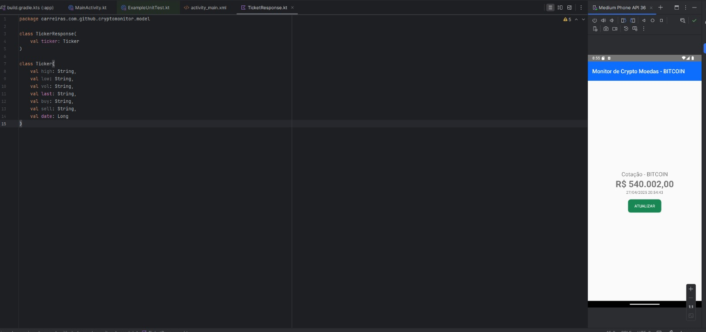
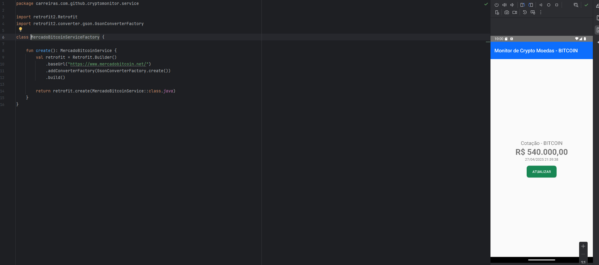
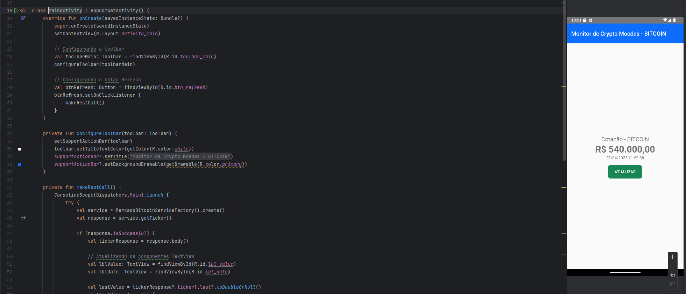
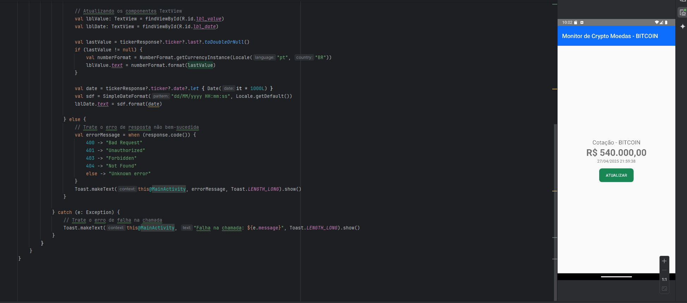

REPRESANTANTES : LUCAS THOMAZETTE BENVENUTO - RM 98048

-PACOTE MODEL
Resposta principal da API, assim no momento que e feita uma requisição HTTP para a nosso API de cotação e devolvido com JSON onde ele já esta estruturado na classe Ticker, onde essa classe Ticker e o modelo real da cotação pois ela contem high: preço mais alto do dia low: preço mais baixo do dia vol: volume de transações last: preço da última negociação buy: preço de compra atual sell: preço de venda atual date: data/hora da informação (em formato timestamp) assim mostrando que o Ticker mostra todas as informações específicas sobre a cotação que vai ser mostrada 

-PACOTE SERVICE
O projeto Monitor de Crypto Moedas usa duas classes para acessar a API do Mercado Bitcoin: MercadoBitcoinService e MercadoBitcoinServiceFactory. A primeira define a chamada GET para buscar a cotação do Bitcoin. Já a segunda cria a configuração do Retrofit, definindo a URL base e o conversor JSON. Assim, o app consegue buscar os dados de forma assíncrona. Ao clicar em "ATUALIZAR", a cotação e o horário são atualizados na tela.

-Pacote Main
O arquivo MainActivity.kt é responsável por gerenciar a interface principal do aplicativo Monitor de Crypto Moedas. Nele, são configurados a toolbar e o botão de atualização, que busca os dados de cotação do Bitcoin. Ao clicar no botão, o app realiza uma chamada à API usando Retrofit e atualiza as informações exibidas, como o valor e a data. Caso ocorra algum erro na comunicação, mensagens de alerta são exibidas para o usuário. Assim, a Activity garante a atualização em tempo real da cotação de forma segura e eficiente.

